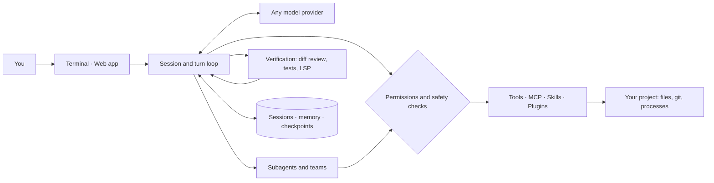

<p align="center">
  <a href="https://github.com/FAHTHIZ/oasis">
    
  </a>
</p>

<p align="center">
  <a href="https://github.com/FAHTHIZ/oasis/actions/workflows/quality.yml"></a>
  <a href="https://github.com/FAHTHIZ/oasis/releases/latest"></a>
  
  
  
  <a href="LICENSE"></a>
  <a href="https://github.com/FAHTHIZ/oasis/stargazers"></a>
</p>

<p align="center">
  <b>The open-source coding agent for any model.</b><br>
  Bring any model, keep your Claude Code setup, and get work that is actually checked.<br>
  OASIS runs on your machine or server and works from the terminal or any browser.<br>
  It supplies the tools, subagents, permissions and memory, and it won't say "tests pass" unless it saw them pass.
</p>

<p align="center">
  <a href="#install"><b>Install</b></a> ·
  <a href="#quick-start"><b>Quick start</b></a> ·
  <a href="#two-ways-to-work">Terminal and web</a> ·
  <a href="#plugins-mcp-and-models">Plugins and models</a> ·
  <a href="#tested-like-a-real-user">Real-user tests</a> ·
  <a href="#how-it-compares">Comparison</a> ·
  <a href="docs/README.md">Docs</a> ·
  <a href="CHANGELOG.md">Changelog</a>
</p>

<br>

<p align="center">
  
  <br><sub>A finished task reopened from the sidebar. Captured by the browser end-to-end test: the real OASIS runtime editing real files and running real tests, driven by a scripted model so every run is reproducible. Unscripted real-model runs are under <a href="#tested-like-a-real-user">Tested like a real user</a>.</sub>
</p>

## Why OASIS

<table>
  <tr>
    <td width="33%" valign="top">
      <h3>Any model, no lock-in</h3>
      OpenAI, Anthropic, Gemini, OpenRouter, Groq, DeepSeek, Mistral, xAI, Bedrock, Vertex AI, Foundry, any OpenAI-compatible endpoint, gateways such as <a href="https://github.com/cheaper-inference/omniroute">OmniRoute</a>, or a local server (Ollama, LM Studio, llama.cpp, vLLM). <code>oasis connect</code> finds a model that can call tools and saves backups for failover.
    </td>
    <td width="33%" valign="top">
      <h3>Your Claude Code setup, as is</h3>
      <code>CLAUDE.md</code>, <code>.claude/agents</code>, skills, slash commands, hooks, settings, <code>.mcp.json</code> and Claude Code plugins from any marketplace load without conversion. Codex plugins and Gemini CLI extensions are converted on install.
    </td>
    <td width="33%" valign="top">
      <h3>It checks its own work</h3>
      After edits, a verification step sends the agent back if it skipped the diff review or the checks. A "tests pass" claim nobody observed is sent back too, and if the check couldn't run, the answer says so. Every edit is checkpointed, so Undo always works.
    </td>
  </tr>
  <tr>
    <td valign="top">
      <h3>Remote-first, secure</h3>
      One web app for laptop, tablet and phone. Files, shell and keys stay on your machine. The browser gets a 256-bit access key, plus DNS-rebinding protection and brute-force lockout. Close the tab mid-task and it picks up where it was.
    </td>
    <td valign="top">
      <h3>A real agent system</h3>
      Parallel, background and resumable subagents, agent teams with a shared task board, a git worktree per agent, <code>/goal</code> to keep going until a condition holds, and cross-session memory and search.
    </td>
    <td valign="top">
      <h3>Safety you can read</h3>
      Clear permission modes, shell-command risk analysis, protected paths, secret scanning, guarded network tools and optional OS or container sandboxes. Project settings that loosen anything wait until you trust the workspace.
    </td>
  </tr>
</table>

## Install

One package gives you the terminal agent and the browser workspace (needs Node.js 22.15+ and Git):

| Method | Command |
| --- | --- |
| macOS, Linux | `curl -fsSL https://raw.githubusercontent.com/FAHTHIZ/oasis/main/scripts/install.sh \| sh` |
| Windows (PowerShell) | `irm https://raw.githubusercontent.com/FAHTHIZ/oasis/main/scripts/install.ps1 \| iex` |
| Homebrew | `brew tap fahthiz/oasis https://github.com/FAHTHIZ/oasis && brew install fahthiz/oasis/oasis-cli` |
| From source | `git clone https://github.com/FAHTHIZ/oasis.git && cd oasis && npm install && npm install --global .` |

The install scripts take the latest stable release, ask before changing anything, and finish with `oasis doctor`. Each release ships the npm tarball and a `SHA256SUMS` file. See [Downloads and releases](docs/RELEASES.md).

## Quick start

```sh
cd your-project
oasis connect        # paste an API key, a model link or a local server address
oasis                # work in the terminal
oasis web --open     # or open the web app on this folder
```

Then ask in plain words: "find out why the login test fails and fix it". OASIS reads the code, edits the files, runs the checks and shows you the diff. `/rewind` (or <kbd>Esc</kbd> <kbd>Esc</kbd>) undoes a turn.

For scripts and CI:

```sh
oasis -p "summarize the open TODOs"                                  # one-shot
oasis exec --output-format stream-json "fix the lint errors" > run.jsonl
oasis -p --permission-mode dont-ask "review this diff"               # never waits on an approval
oasis -p --permission-mode auto --goal "npm test passes"              # keeps going until the check says it holds
```

## Two ways to work

OASIS has two interfaces, both on the same runtime, sessions and settings. Start a task in the terminal and continue it in the browser under **Chats → Earlier on this computer**.

<table>
  <tr>
    <th width="50%">Terminal — <code>oasis</code></th>
    <th width="50%">Web app — <code>oasis web --open</code></th>
  </tr>
  <tr>
    <td><a href="assets/demo/oasis-real-model-demo.mp4"></a></td>
    <td></td>
  </tr>
  <tr>
    <td>Streaming diffs with word highlights, inline images, <code>/tasks</code>, <code>/rewind</code>, <code>/export</code> to Markdown or HTML. <code>oasis -p</code> and <code>oasis exec</code> for scripts, with JSON output and <code>--output-schema</code>.</td>
    <td>Live timeline with expandable execution groups, a task sidebar, Files and Changes panels, a real terminal (<kbd>Ctrl</kbd>+<kbd>&#96;</kbd>), plan mode, Undo, cost and context meters, <code>/</code> and <code>@</code> autocomplete, voice input, and one-click Claude Code plugins.</td>
  </tr>
</table>

The web app runs on a computer or server you control, not a hosted service, and opens in any modern browser. An optional [desktop app](docs/DESKTOP.md) for Windows, macOS and Linux shows the same workspace in its own window; there is no separate mobile app.

### Use it from anywhere

```sh
oasis web --public-url https://oasis.example.com --trust-proxy   # behind Caddy, nginx, Tailscale Serve or Cloudflare Tunnel
oasis web key                                                    # show the access key; --rotate replaces it
```

Open the address on any device, paste the link once and tick **Remember this device**. Tasks run on the server, so a reload or dropped connection reattaches to the running task and asks any open approval again. Recipes and the full security model: [Remote access](docs/REMOTE-ACCESS.md).

<table>
  <tr>
    <td width="50%"></td>
    <td width="22%"></td>
    <td width="28%"></td>
  </tr>
  <tr>
    <td><sub>Light theme</sub></td>
    <td><sub>Phone width</sub></td>
    <td><sub>Signing in from another device</sub></td>
  </tr>
</table>

OASIS also plugs into other tools: VS Code, Cursor and Windsurf (`oasis ide install`), Zed and JetBrains through the Agent Client Protocol (`oasis acp`), a Node.js SDK, a GitHub Action, and Telegram, Slack or Discord gateways. See [Interfaces](docs/INTERFACES.md).

## Plugins, MCP and models

### Claude Code plugins

Open **Plugins** in the web app, add Anthropic's official marketplace (about 300 plugins) and install with one click. Or use the terminal:

```sh
oasis plugin marketplace add anthropics/claude-plugins-official
oasis plugin install superpowers@claude-plugins-official
oasis -p "/commit-commands:commit"
```

Plugin commands, agents, skills, hooks, MCP servers and language servers load the way they do in Claude Code. These popular plugins were installed and used in OASIS on 8 November 2026:

| Plugin | What it adds | Checked in OASIS |
| --- | --- | --- |
| superpowers | Planning, TDD and debugging skills, session-start hook | Skills listed and used; hook ran |
| frontend-design, feature-dev, code-review, pr-review-toolkit, code-simplifier | Agents, skills and commands | Loaded |
| security-guidance | Security hooks | Session-start hook ran (about 10 s) |
| hookify | Your own hooks from plain language | PreToolUse and PostToolUse ran |
| commit-commands | `/commit`, `/commit-push-pr` | Committed in a live run |
| context7, playwright, github, figma | MCP servers | Installed; playwright starts. context7 and figma ask you to sign in (`oasis mcp login context7`); github needs `GITHUB_PERSONAL_ACCESS_TOKEN` |
| typescript-lsp | TypeScript language server | Loaded |
| claude-md-management, ralph-loop | Commands and hooks | Loaded |

Plugins are not free. With 16 plugins on, each request used to carry 46 tools and 36.5k characters of tool schemas. OASIS now keeps large MCP servers behind `tool_search` until the model asks for them, which cuts that to 21 tools and 16.5k characters (about 5,000 fewer tokens per request). Plugin prompt text and skills still add up, so turn off the ones you don't use.

### Codex and Gemini CLI plugins

`oasis add` also takes Codex plugins (`.codex-plugin/plugin.json`), Agent Plugins and Gemini CLI extensions, and converts them to Claude Code plugins on install:

```sh
oasis add BuilderIO/skills
oasis add owner/marketplace#plugin-name
```

Checked on 9 November 2026: BuilderIO/skills, n8n-io/skills, DataDog/pup and NVIDIA/nvidia-kaggle installed with all 78 of their skills. Bundled MCP servers start from the plugin folder the way Codex starts them. Some Codex plugins still need their own setup first: nexu-io/codex-slides needs `pnpm install` inside the plugin, and Storybloq needs the `storybloq` program on your PATH.

### Connect an app in one step

Say "connect GitHub" (or `/connect linear`) in the terminal or the web app and a Connect card appears in the conversation. Click **Connect**, approve access on the service's own page, and its tools are ready in the same chat; the agent's turn carries on where it was. The agent shows the same card itself when a task needs an app you have not connected (`connect_service`).

- GitHub uses your existing `gh` sign-in at once, or runs `gh auth login --web` and shows the one-time code on the card; without `gh` it takes a pasted token.
- Linear, Notion, Sentry, Atlassian (Jira, Confluence), Stripe, Vercel, Supabase, Neon, Cloudflare, Hugging Face, monday.com, Intercom, Airtable, Square, Webflow, Granola, PayPal, PostHog, Netlify, Prisma, Semgrep, Jam, Wix, Supermemory, Apify, Tavily, Close, Attio, Todoist, GitLab, Miro, Buildkite, Honeycomb, Axiom, Sanity, Postman, Klaviyo, Fireflies, Dropbox, Make, Cal.com, Grafana Cloud and Mux sign in with OAuth (dynamic client registration). DeepWiki, Exa, Context7 and the Cloudflare docs need no sign-in. Any other remote MCP server works by name from the official MCP Registry or by URL.
- Already connected? Nothing is shown. Signed in earlier? It reattaches quietly. Signing in from your phone? Paste the address the browser landed on into the card.
- `oasis mcp connect NAME` does the same from a shell; `/connect` alone lists what can be connected.

### MCP servers

```sh
oasis mcp search filesystem                            # the official MCP Registry
oasis mcp add everything -- npx -y @modelcontextprotocol/server-everything
oasis mcp add --transport http docs https://example.com/mcp
oasis mcp serve                                        # expose OASIS tools to other MCP clients
```

Stdio, HTTP and SSE, with OAuth (`oasis mcp login`), elicitation and MCP Tasks. The web app manages servers under **Settings → Tools**. Project `.mcp.json` servers wait until you trust the workspace.

### Models and providers

`oasis connect` takes an API key, a model page link or a server address. It works out the provider, lists the models, tests the best ones with a real tool call and saves the first that works plus backups.

```sh
oasis connect                              # paste a key (kept out of shell history)
oasis connect --from-env gemini            # use GEMINI_API_KEY
oasis connect --from-env nvidia            # use NVIDIA_API_KEY from build.nvidia.com (nvapi-…)
oasis connect http://localhost:11434       # Ollama, LM Studio, llama.cpp or vLLM
oasis connect http://127.0.0.1:20128/v1    # an OmniRoute gateway
```

OpenAI Responses, Chat Completions and Anthropic Messages protocols; prompt caching; automatic compaction; spend limits (`--max-budget-usd`). See [Model providers](docs/CONFIGURATION.md#model-providers).

## Tested like a real user

These runs used the released app the way a person would: type a request, approve steps, read the answer. Real providers, no scripted model. Recorded 5–8 November 2026.

| What we asked | Where | Model | Result |
| --- | --- | --- | --- |
| "Build a small to-do web app in index.html" | Web app | gpt-oss-20b (free) | Working app in about 6 minutes |
| "math.mjs add() is wrong. Fix it and add a test, then run it." | `oasis -p` | gpt-oss-20b | Fixed, test written and passing, exit 0. About 10 minutes, mostly provider wait. |
| "slugify() only replaces the first space. Fix it, add a test, run the tests." | Web app, Ask first | gpt-oss-20b | Fixed with a global regex, test added, 1 passing. 409 s, 2 approvals. [Screenshot](assets/screenshots/real-model-task-dark.png) (earlier interface). |
| Fix a bug and run the tests after approval | Terminal | gpt-oss-20b | Passed |
| Read an uploaded PDF | Web app | gpt-oss-20b | Passed in 49 s ([screenshot](assets/screenshots/real-model-pdf.png)) |
| Install 16 Claude Code plugins and use them | Web app and terminal | gpt-oss-20b | All installed; hooks, skills and MCP servers ran |
| Call an MCP tool in auto mode | Terminal | gpt-oss-20b | Passed |
| Delegate to an `explore` subagent in a worktree | Terminal | gpt-oss-20b | Passed; worktree removed afterwards |
| Continue a terminal session in the browser | Web app | gpt-oss-20b | Passed |

Everything that went wrong in these runs became a fix with a regression test. Examples: a streamed reply glued onto the next one, the agent telling the user about its internal checks, a keyless endpoint that kept asking for a key, activity cards that all said "Completed a project step". See the [Changelog](CHANGELOG.md).

Known rough edges: free endpoints are slow (35–140 s per request), and with small models the verification step sometimes produces a second, longer summary after the first. `oasis -p` used to print nothing until it finished; it now shows one line per step.

## Benchmarks

`scripts/bench-live.mjs` runs OASIS and other agents on the same tasks, model and gateway, and checks each result with a hidden verifier. Latest live run, through OmniRoute with `nemotron-3-ultra-550b` (free tier, one trial):

| Task | OASIS | Claude Code 2.1.319 |
| --- | --- | --- |
| `clamp-integer` (small) | Pass · 44 s · 55k tokens | Pass · 121 s · 52k tokens |
| `safe-relative-path` (medium) | Fail · 28 s · 121k tokens | Fail · 59 s · 50k tokens |

Two tasks and one trial cannot rank agents, and OASIS does not guarantee that every model will solve every task: results depend heavily on the model. The free tier allowed about 50 requests a day. A larger run with a strong model is the next step. Raw results: [bench/results/live-2026-11-08-omniroute](bench/results/live-2026-11-08-omniroute/README.md). Method: [docs/BENCHMARKS.md](docs/BENCHMARKS.md).

## How it compares

| | OASIS | Claude Code | Codex CLI | Cursor CLI | OpenCode | Kimi Code | Hermes Agent |
| --- | --- | --- | --- | --- | --- | --- | --- |
| Open source | Apache-2.0 | No | Apache-2.0 | No | Yes | MIT | Yes |
| Models | Any provider or local server | Anthropic | OpenAI first | Cursor's catalog, some BYOK | Any provider | Kimi first | Any provider |
| Runs Claude Code plugins | Yes, plus Codex plugins and Gemini extensions | Yes | Own plugins | Own rules and hooks | Own plugins | Own skills | Own skills |
| Web interface | Self-hosted, remote-ready | Cloud | Cloud | Cloud agents | Local web app | Local web app | Messaging apps |
| Subagents | Parallel, background, resumable, teams, worktrees, `/batch` (`/swarm`) | Yes | Yes | Yes | Yes | Yes | Yes |
| Keeps going until a goal holds | `/goal` with pause and resume, also in `-p --goal` for CI | ralph-loop plugin | `/goal` | Long-running cloud agents | Not documented | `/goal` | Not documented |
| Refuses unobserved "tests pass" claims | Built in | With hooks | Not documented | Not documented | Not documented | Not documented | Not documented |

Gemini CLI is now for Gemini Code Assist enterprise users; free and AI Pro users were moved to Antigravity CLI. OASIS still trails in model-specific tuning, hosted cloud runs, community size and real-world hours. The full comparison, with sources, is in [docs/COMPARISON.md](docs/COMPARISON.md).

## How it works


```mermaid
flowchart LR
    U[You] --> I[Terminal · Web app]
    I --> S[Session and turn loop]
    S <--> M[Any model provider]
    S --> P{Permissions and safety checks}
    P --> T[Tools · MCP · Skills · Plugins]
    T --> W[Your project: files, git, processes]
    S --> A[Subagents and teams]
    A --> P
    S --> V[Verification: diff review, tests, LSP]
    V --> S
    S <--> D[(Sessions · memory · checkpoints)]
```

The model proposes replies and tool calls. OASIS decides which tools exist, which calls need approval, what goes back to the model and what counts as verified. See [Architecture](docs/ARCHITECTURE.md).

## Security

OASIS can read and change files, run commands and send context to your model provider, with your account's permissions.

- Permission modes go from `plan` (read-only) to `dont-ask` (never waits, denies anything not allowed). The default runs read-only commands freely and asks before other commands, installs, deletions and new websites.
- The OS sandbox (bubblewrap, macOS Seatbelt, Docker or Podman) is optional. `oasis doctor` tells you whether it's on.
- Project settings that loosen permissions, run hooks or start MCP servers apply only after you trust the workspace.
- Plugins, hooks and MCP servers can run third-party code. Review them before turning them on.
- Approval prompts are not a replacement for operating-system isolation. Use the sandbox, a container or a throwaway machine for untrusted code.

Read the [security policy](SECURITY.md) before using OASIS on sensitive code.

## Development

```sh
npm install
npm test           # about 2,350 tests
npm run check      # tests, benchmark regressions, eval validation
npm run lint
```

CI also runs platform security tests, a live Docker sandbox test, native PTY tests and a browser test that drives the web app like a person: a task with an approval, a page reload mid-task that must reattach, an approval answered from a second browser, reopening the finished task in a fresh browser with all its steps, signing in with Remember this device, and WCAG contrast checks in dark, light, phone and sign-in views. Contributions are welcome: start with the [Contributing guide](CONTRIBUTING.md).

## Documentation

| Get started | Go deeper | Project |
| --- | --- | --- |
| [User guide](docs/USER-GUIDE.md) | [Architecture](docs/ARCHITECTURE.md) | [Changelog](CHANGELOG.md) |
| [First run](docs/FIRST-RUN.md) | [Configuration](docs/CONFIGURATION.md) | [Contributing](CONTRIBUTING.md) |
| [Interfaces](docs/INTERFACES.md) | [Subagents](docs/SUBAGENTS.md) | [Security](SECURITY.md) |
| [Downloads](docs/RELEASES.md) | [Comparison](docs/COMPARISON.md) | [Support](SUPPORT.md) |
| [Releases](docs/RELEASES.md) | [Benchmarks](docs/BENCHMARKS.md) | [Brand guidelines](BRAND.md) |

## License

[Apache License 2.0](LICENSE).
